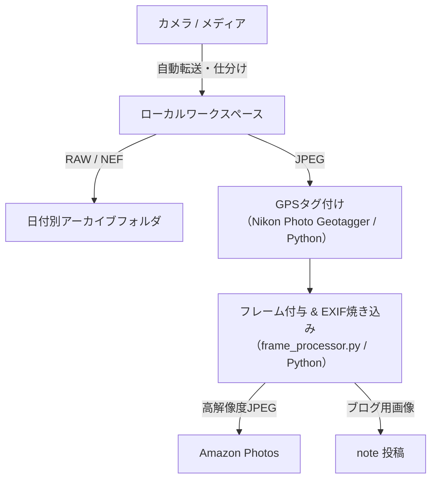

# PhotoWorkflow

カメラからの取り込みから、位置情報の付与、フレーム付与・EXIF焼き込み、そしてクラウドバックアップやブログ（note）への公開までを一貫して効率化するための自動化ワークフローツール群です。

## 主な機能

1. **自動転送・仕分け (Python / PowerShell)**
   - カメラやメディアから画像ファイルを自動転送。
   - RAW（NEF等）とJPEGを自動で振り分け、日付別フォルダへ綺麗にアーカイブ。
2. **GPS位置情報付与 (Nikon Photo Geotagger)**
   - C#製デスクトップアプリにより、写真アーカイブへスムーズにGPSタグを付与。
3. **フレーム付与 & EXIF焼き込み (`frame_processor.py`)**
   - ExifToolを用いたメタデータの一括取得（バッチ処理による高速化）。
   - 機材名（例: `Z50II` など）の表記ゆれやフォーマットの自動補正。
   - 枠線、ブランドロゴ、撮影データ（シャッタースピード、F値、ISO、焦点距離など）の洗練されたレイアウト描画。
4. **クラウド・ブログ連携**
   - 処理済みの高品質JPEG画像を Amazon Photos へバックアップ。
   - `note` プラットフォームでの公開に最適化された画像管理。

---

## 処理フロー概要



---

## 使い方

```
python main.py
```

起動するとメニューが表示され、実行したいステップを番号で選びます。選んだステップだけを実行し、終わるとメニューに戻ります。

```
==================================================
      写真整理ワークフロー  メニュー
==================================================
  取り込み元: C:\SHARE\Photo\from_camera
    JPEG 120 件 / RAW 120 件 / GPX 2 件
--------------------------------------------------
  [1] STEP 1: GPS位置情報の書き込み
  [2] STEP 1.5: 手動GPS情報付与
  [3] STEP 2: 写真整理・コピー
  [4] STEP 2.5: EXIF抽出・書き出し処理
  [5] STEP 3: フレーム付与処理
  [A] 全ステップを順に実行（各ステップの前に確認あり）
  [Q] 終了
--------------------------------------------------
番号を入力してください:
```

- 取り込み元フォルダがなくても、STEP 2.5 と STEP 3（`to_note` が対象）は実行できます。
- `config.json` の `steps` で無効にしたステップは「※config で無効」と表示され、実行できません。
- ステップ実行中に Ctrl+C を押すと、そのステップを中断してメニューに戻ります。

### コマンドラインオプション

| オプション | 内容 |
|---|---|
| `--step STEP` | メニューを出さずに指定したステップだけを実行（複数指定可。例: `--step gps_tag --step copy`） |
| `--all` | メニューを出さずに全ステップを順に実行（各ステップの前に確認あり） |
| `--yes`, `-y` | メニューを出さずに全ステップを確認なしで実行（タスクスケジューラなど無人実行向け） |
| `--skip STEP` | 全ステップ実行時に指定したステップを飛ばす |
| `--dry-run` | ファイル操作をせず、実行予定のステップだけ表示 |
| `--list-steps` | ステップ名の一覧を表示 |
| `--config PATH` | 使用する `config.json` を指定 |

ステップ名: `gps_tag` / `manual_gps` / `copy` / `exif_export` / `frame`
